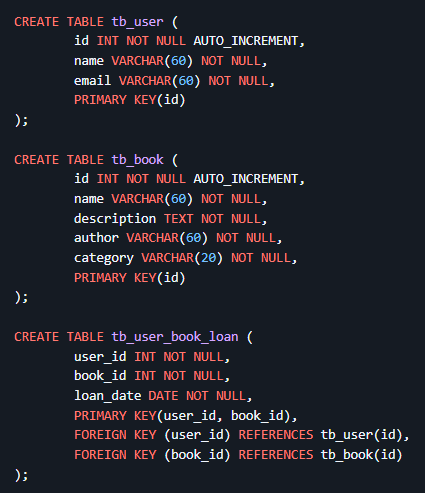
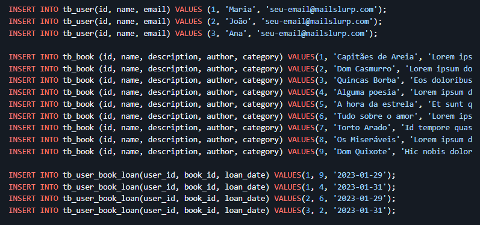
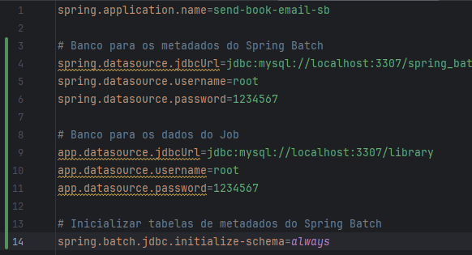
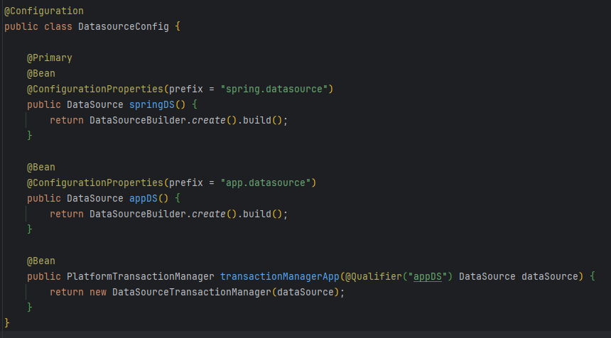
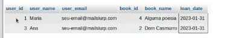
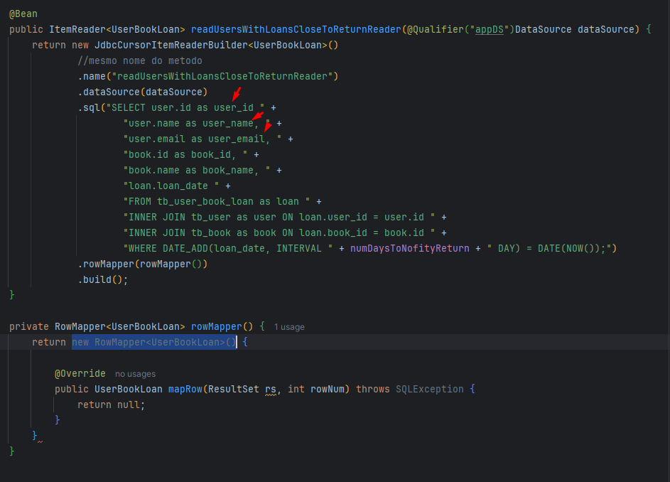
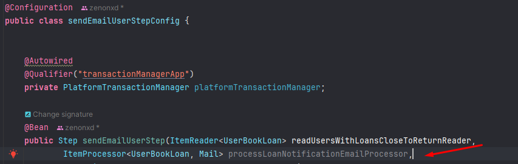
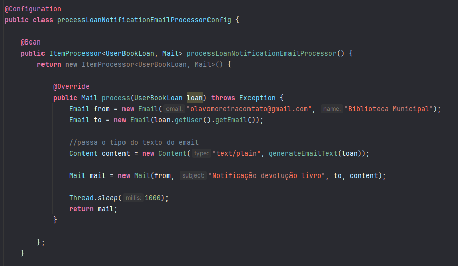

<p align="center">
  
</p>

# Objetivo

Um projeto onde desenvolveremos um job responsável por fazer envio de emails automático usando Spring Batch.

Um dos usos mais comuns do Spring Batch é o envio de emails em massa.

Usaremos:

SendGrid (envio de email transacional).

[Github Projeto](https://github.com/devsuperior/send-book-email-spring-batch)

# Modelo de Dados usado

Usaremos o exemplo de uma livraria.

Teremos table de User, Book e de empréstimos de livros para usuário.

# Regra de negócio

Assim que o usuário pegar o livro, ele terá 7 dias para fazer a devolução ou a renovação (extender o prazo).

Se ele pegou o dia no dia 31 por exemplo, ele terá que devolver no dia 07 (sétimo dia).

Enviaremos então no dia 06 um email para todos os usuários que tem livros a serem devolvidos no dia seguinte.

Essa será a função do Job, notificar esses usuários!

# Steps Spring Batch

Reader: ler usuários que tem empréstimos próximo do retorno (numero de dias para retornar - 1 dia)

Processing: gerar mensagem do email (template)

Writing: enviar o email notificando o retorno

# Resources

[Clique aqui](https://github.com/devsuperior/send-book-email-spring-batch?tab=readme-ov-file#resources)

# Criação Banco de Dados

Inserir o ``DockerCompose.yaml`` na pasta para criar o ambiente.

Ele conterá o MySQL e o phpMyAdmin.

Crie os bancos necessários:

1. Banco para salvar metadados Spring Batch, chamará: **spring_batch**
2. Banco para salvar as tabelas criadas (user, book, user_book_loan), chamará: **library**

Use o script do import.sql para dar o creat no phpMyAdmin.



Depois, insira os dados. ❗Importante, no user coloque o email que você irá utilizar.

Além disso, se atente as datas do spring, visto que esse projeto foi elaborado em fevereiro de 2023.



# Criando classes domínio

Crie uma classe ``import.sql`` e jogue o seed todo lá para deixar salvo e documentado.

## User

```java
@NoArgsConstructor
@AllArgsConstructor
@Getter
@Setter
@ToString
public class User {

    private int id;
    private String name;
    private String email;

}
```

## Book

```java
@NoArgsConstructor
@AllArgsConstructor
@Getter
@Setter
@ToString
public class Book {
    
    private Integer id;
    private String name;
    private String description;
    private String author;
    private String category;

}
```

## UserBook Loan

```java
@NoArgsConstructor
@AllArgsConstructor
@Getter
@Setter
@ToString
public class UserBookLoan {

    private User user;
    private Book book;
    private Date loanDate;
}
```

# Configuração DataSources

Recapitulando.

Teremos a nossa aplicação que alocará os metadados para o banco de dados spring_batch (criado no phpMyAdmin).

Agora, os dados advindos do Job iremos alocar no banco library.

## application.properties



## Classe DataSourceConfig




# Configurando Job e Step

Recapitulando: queremos criar um Job responsável por fazer enviar automaticamente usando o Spring Batch.

Ele notificará sobre empréstimo determinado usuário.

## Job

Os nomes precisam ser autoexplicativos, lembra?

```java
@Configuration
public class SendBookLoanNotificationJobConfig {

    @Bean
    public Job SendBookLoanNotificationJob(Step sendEmailUserStep, JobRepository jobRepository) {
        return new JobBuilder("SendBookLoanNotificationJob", jobRepository)
                .start(sendEmailUserStep)
                .incrementer(new RunIdIncrementer())
                .build();
    }
}
```

## Step

O que o step deve fazer? Enviar o email para o usuário.

❗Este código irá mudar.

Criaremos o PlatformTransactionManager, passando o Qualifier do DataSourceConfig.

O chunk receberá um UserBookLoan e ❗❗POR ENQUANTO retornará o mesmo, demais será um email.

E já começamos passando o ItemReader, também do tipo UserBookLoan.

```java
@Configuration
public class sendEmailUserStepConfig {

    private int chunkSize;

    @Autowired
    @Qualifier("transactionManagerApp")
    private PlatformTransactionManager platformTransactionManager;

    @Bean
    public Step sendEmailUserStep(ItemReader<UserBookLoan> readUsersWithLoansCloseToReturnReader,
            JobRepository jobRepository) {
        return new StepBuilder("sendEmailUserStep", jobRepository)
                .<UserBookLoan, UserBookLoan>chunk(1, platformTransactionManager)
                .reader(readUsersWithLoansCloseToReturnReader)
                .build();
    }
}
```

### ItemReader

Como vimos ali em cima, o ItemReader deve:

Ler usuários que tem empréstimos próximo do retorno (numero de dias para retornar - 1 dia)

O nome será: ``readUsersWithLoansCloseToReturnReaderConfig``

Inicialmente, criaremos um método para a classe que irá receber como parâmetro o data source. Usaremos o banco de dados
library. Este método, retornará um ItemReader do tipo UserBookLoan.

Quando gostaríamos de obter dados do banco de dados, existe uma classe que extende o ItemReader, ela se chama: 
``JdbcCursorItemReaderBuilder``.

#### Como o método ficará inicialmente:

```java
    @Bean
    public ItemReader<UserBookLoan> readUsersWithLoansCloseToReturnReader(@Qualifier("appDS")DataSource dataSource) {
        return new JdbcCursorItemReaderBuilder<UserBookLoan>()
}
```

#### Método pronto

```java
    @Bean
    public ItemReader<UserBookLoan> readUsersWithLoansCloseToReturnReader(@Qualifier("appDS")DataSource dataSource) {
        return new JdbcCursorItemReaderBuilder<UserBookLoan>()
                //mesmo nome do metodo
                .name("readUsersWithLoansCloseToReturnReader")
                .dataSource(dataSource)
                .sql("SELECT user.id as user_id " +
                        "user.name as user_name, " +
                        "user.email as user_email, " +
                        "book.id as book_id, " +
                        "book.name as book_name, " +
                        "loan.loan_date " +
                        "FROM tb_user_book_loan as loan " +
                        "INNER JOIN tb_user as user ON loan.user_id = user.id " +
                        "INNER JOIN tb_book as book ON loan.book_id = book.id " +
                        "WHERE DATE_ADD(loan_date, INTERVAL " + numDaysToNofityReturn + " DAY) = DATE(NOW());")
                .rowMapper(rowMapper())
                .build();
    }
```

#### rowMapper()

Vamos utilizar ele para obter os dados e atributos (através da consulta SQL), e passaremos estes dados para nossos 
objetos que criamos no nosso domínio (User, Book, UserBookLoan).

Criamos o método e passamos nele: ``return new RowMapper<UserBookLoan>()``. Depois clicamos e implementamos o 
método ``mapRow``.

MapRow = correspondência da linha.

Ou seja, leremos linha a linha e obter os valores dos atributos correspondentes. 



Para obter esses campos com mais facilidade, defina um ALIAS na consulta SQL, veja:



#### Método

```java
    private RowMapper<UserBookLoan> rowMapper() {
    //criando esse metodo, ele ira pedir para implementar
    //o mapRow abaixo
        return new RowMapper<UserBookLoan>() {

            @Override
            public UserBookLoan mapRow(ResultSet rs, int rowNum) throws SQLException {
                //pegando id, name e email
                User user = new User(
                        rs.getInt("user_id"),
                        rs.getString("user_name"),
                        rs.getString("user_email")
                );

                Book book = new Book();
                book.setId(rs.getInt("book_id"));
                book.setName(rs.getString("book_name"));

                UserBookLoan userBookLoan = new UserBookLoan(user, book, rs.getDate("loan_date"));

                return userBookLoan;
            }
        };
    }
```

### ItemProcessor

Na etapa de processamento, precisamos realizar a lógica de envio de email (utilizando um template).

Adicione a dependência do SendGrid para envio de email.

```xml
<dependency>
    <groupId>com.sendgrid</groupId>
    <artifactId>sendgrid-java</artifactId>
</dependency>
```

Volte para o nosso Step, e insira o ``ItemProcessor<UserBookLoan, Mail>`` se chamará ``processLoanNotificationEmailProcessor``.



Esse "Mail" do parâmetro, é da dependência SendGrid.

#### processLoanNotificationEmailProcessorConfig

Crie o método e insira o construtor e implemente o método process! Ficará assim:

```java
@Configuration
public class processLoanNotificationEmailProcessorConfig {

    @Bean
    public ItemProcessor<UserBookLoan, Mail> processLoanNotificationEmailProcessor() {
        return new ItemProcessor<UserBookLoan, Mail>() {
            @Override
            public Mail process(UserBookLoan loan) throws Exception {
                return null;
            }
        }
    }
}
```

Esse process ele recebe cada item do ``UserBookLoan`` (todos os dados do empréstimo) e retorna um ``Mail``. Ou seja,
um objeto pronto para ser enviado.

#### Método final



#### Template Email

Ele vai receber um UserBookLoan e com um StringBuilder, irá construir a mensagem.

```java
private String generateEmailText(UserBookLoan loan) {		
    StringBuilder writer = new StringBuilder();
    writer.append(String.format("Prezado(a), %s, matricula %d\n", loan.getUser().getName(), loan.getUser().getId()));
    writer.append(String.format("Informamos que o prazo de devolução do livro %s é amanhã (%s) \n", loan.getBook().getName(), GenerateBookReturnDate.getDate(loan.getLoan_date())));
    writer.append("Solicitamos que você renove o livro ou devolva, assim que possível.\n");
    writer.append("A Biblioteca Municipal está funcionando de segunda a sexta, das 9h às 17h.\n\n");
    writer.append("Atenciosamente,\n");
    writer.append("Setor de empréstimo e devolução\n");
    writer.append("BIBLIOTECA MUNICIPAL");
    return writer.toString();
}
```

Precisamos agora criar uma classe utilitária para obter a data de devolução em String (veja o "GenerateBookReturnDate") 
do método do generateEmail.

#### Criando classe utilitária para obter data - GenerateBookReturnDate

Essa classe será responsável por obter a data de empréstimo no formato String.

A ideia é que a gente a acesse da forma que está lá no método. Chamando: o seu nome "ponto", o método que queremos 
implementar.

Para isso ela será uma classe constante, ou seja, "public final class".

Precisamos começar definindo as regras de negócio.

Iremos definir o número de dias para devolução do livro no início.

Depois, criamos o método getDate, toda a explicação do código está ali embaixo.


```java
public final class GenerateBookReturnDate {

    public static int numDaysToReturnBook = 7;

    //definindo dada formato DD-MM-YYYY
    private static DateFormat dateFormat = new SimpleDateFormat("dd/MM/yyyy");

    // pega a data formatada do emprestimo do livro
    public static String getDate(Date loan_Date) {
        Calendar calendar = dateToCalendar(loan_Date);

        //adicionaremos o número de dia (7 dias) para devolução do livro
        calendar.add(Calendar.DATE, numDaysToReturnBook);

        //e agora converte para String, mas precisamos criar outro metodo
        //para converter de calender para date,
        // pois o dateFormat precisa receber um Date (atualmente está Calendar)!
        String result = dateFormat.format(calendarToDate(calendar));
        return result;
    }

    //metodo para converter de Calendar pra Date, pois é o que o dateFormat precisa
    //para que possamos retornar uma String
    private static Date calendarToDate(Calendar calendar) {
        return calendar.getTime();
    }

    //converts Date do Calendar
    private static Calendar dateToCalendar(Date loanDate) {

        //instancia o calender com getInstance
        Calendar calendar = Calendar.getInstance();
        //e converte
        calendar.setTime(loanDate);
        return calendar;
    }

}
```

### ItemWritter - Envio de email

Qual a ideia do ItemWritter? Queremos que ele envie um email solicitando o retorno dos livros para o User.

Portanto, se chamará: ``sendEmailRequestReturnWritterConfig``.

Vamos criar o nosso método ``sendEmailRequestReturnWritterConfig``, que retornará um ``ItemWriter<Mail>``.

Precisamos criar um método para realizar o envio de email, [clique aqui](https://github.com/devsuperior/send-book-email-spring-batch?tab=readme-ov-file#method-to-send-email-writer-step)

Este método ficará dentro da classe do Writter, depois do método que criamos do Bean.

#### Variável de ambiente

Logue no sendGrid, obtenha o valor da chave e coloque como variável de ambiente na IDE (não é no app.properties), e sim
na variável de ambiente.

``spring.sendgrid.api-key=KEY_SENDGRID``

Com isso, ao rodar a aplicação, o email será enviado.

#### Agendando envio de email com Quartz

Queremos que a execução do nosso Job seja agendada, e usaremos o Quartz juntamente com o Spring Batch, configurando
a periodicidade do envio de emails.

Como o JobLauncher é responsável pela execução do nosso Job, criaremos um ``JobLauncher`` no pacote ``job``. A classe
irá se chamar ``SendBookLoanNotificationScheduleJob``. Utilize o código abaixo:

```java
@Configuration
public class SendBookLoanNotificationScheduleJob extends QuartzJobBean {
	
	@Autowired
	private Job job;
	
	@Autowired
	private JobExplorer jobExplorer;
	
	@Autowired
	private JobLauncher jobLaucher;

	@Override
	protected void executeInternal(JobExecutionContext context) throws JobExecutionException {
		JobParameters jobParameters = new JobParametersBuilder(this.jobExplorer).getNextJobParameters(this.job).toJobParameters();
		try {
			this.jobLaucher.run(this.job, jobParameters);
		} catch (Exception e) {
			e.printStackTrace();
		}
	}
	
}
```

Importe agora a dependência do Quartz.

#### Dependência Quartz

```xml
<dependency>
    <groupId>org.springframework.boot</groupId>
    <artifactId>spring-boot-starter-quartz</artifactId>
</dependency>
```

#### Colocando o Job criado como primário

Para o spring saber que queremos executar esse JobLaucher, precisamos configurar no ``application.properties``.

```properties
spring.batch.job.enabled=false
```

#### Configurando Quartz

Crie no pacote config a classe ``QuartzConfig``.

Importe tudo do ``Org.quartz``.

```java
@Configuration
public class QuartzConfig {

    @Bean
    public JobDetail quartzJobDetail() {
        return JobBuilder.newJob(SendBookLoanNotificationScheduleJob.class).storeDurably().build();
    }

    @Bean
    public Trigger jobTrigger() {
        // 51 18 = 18:51
        //qualquer coisa pesquise sobre cron expressions

        String exp = "0 51 18 * * ?";
        return TriggerBuilder
                .newTrigger()
                .forJob(quartzJobDetail())
                .startNow()
                .withSchedule(CronScheduleBuilder.cronSchedule(exp))
                .build();
    }
}
```


